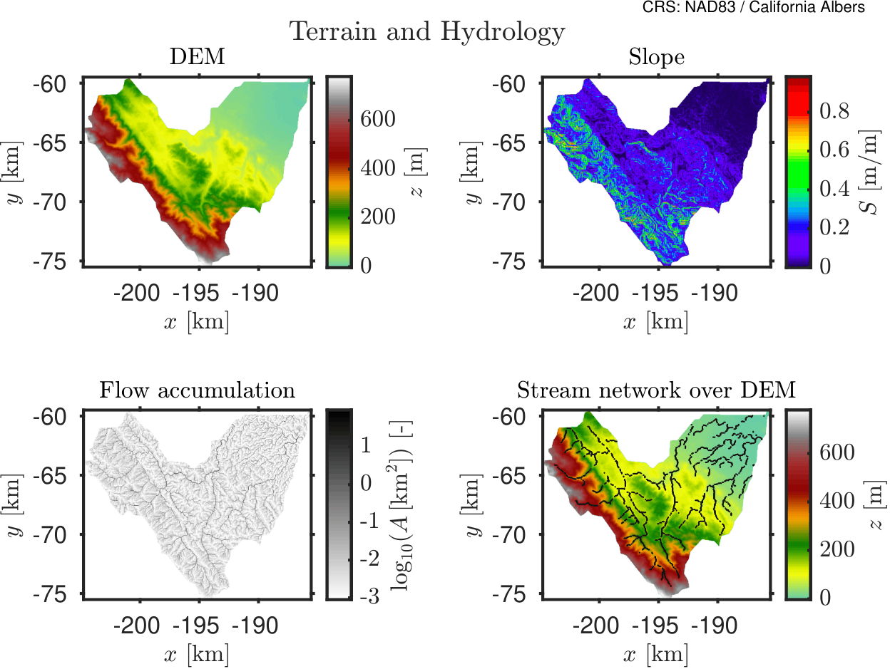

import useBaseUrl from '@docusaurus/useBaseUrl';

# Catchment Setup and Experiment Design

## Overview

This document describes the setup of a hydrological simulation over a catchment within the San Francisquito Creek watershed in California, USA.

The objective of this first example is to establish a reproducible workflow for preparing spatial input data and defining a controlled rainfall experiment using HydroPol2D.

Rather than reproducing a real storm event, this case study focuses on evaluating the intrinsic hydrological response of the catchment under an idealized rainfall forcing. This approach allows isolation of key physical processes such as runoff generation, infiltration, and flow routing.

---

## Input Data Sources and Preparation

All spatial input datasets required for the simulation were derived using a Google Earth Engine (GEE) workflow. The script automates the extraction, processing, and export of geospatial layers necessary to parameterize the hydrological model.

For this study, a simplified set of core datasets is used:

- Digital Elevation Model (DEM) 
- Land Use / Land Cover (LULC) 
- Soil Texture

These datasets are sufficient to capture the primary controls on surface runoff generation and routing for this baseline experiment.

The full data extraction workflow is provided in the accompanying script.

---

## Catchment Delineation

The study domain corresponds to a sub-catchment within the San Francisquito Creek watershed, which drains areas of the San Francisco Peninsula, including parts of the Stanford region and surrounding urban and peri-urban environments.

The catchment was delineated using the HydroBASINS dataset (level 12, catchment number 7120013410), which provides globally consistent watershed boundaries. A specific basin was selected using its unique HYBAS_ID and extracted from the HydroSHEDS database.

The delineation workflow includes:

- Selection of the target basin using its HydroBASINS identifier  
- Extraction of the corresponding polygon  
- Dissolution into a unified catchment geometry  
- Export of the resulting boundary as a shapefile  

This approach ensures reproducibility and consistency with globally available hydrographic datasets.

---

## Spatial Data Processing

All raster datasets were processed following a standardized workflow:

- Clipping to the catchment boundary  
- Reprojection to a common coordinate system (California Albers, EPSG:3310)  
- Resampling to a uniform spatial resolution (30 m)  
- Assignment of consistent no-data values  

Only the following layers are used in the model for this study:

- DEM (topographic control)  
- LULC (surface properties and runoff generation)  
- Soil Texture (infiltration characteristics)
- Depth to the aquifer/bedrock (vadose zone)  

Other available datasets (e.g., albedo, LAI, initial soil moisture) are excluded in this experiment to reduce model complexity and isolate the dominant hydrological processes.

---

## Meteorological Forcing Strategy

HydroPol2D supports fully distributed meteorological inputs derived from datasets such as CHIRPS, ERA5-Land, and NLDAS, typically processed into spatially distributed rainfall time series.

However, for this initial experiment, a simplified forcing approach is adopted.

Instead of using observed rainfall data, an idealized rainfall pulse is applied uniformly over the catchment. This allows the analysis to focus on the hydrological behavior of the system without the added complexity and uncertainty of real meteorological inputs.

---

## Study Objective

The objective of this study is to evaluate the dynamic response of the San Francisquito Creek catchment under a controlled rainfall event.

The experiment is defined as follows:

- Rainfall forcing:  
  - Constant intensity of 100 mm/h  
  - Duration of 1 hour  

- Simulation period:  
  - Total duration of 24 hours  

- Output frequency:  
  - Spatial maps saved every 15 minutes  

This setup enables analysis of:

- Runoff generation and timing  
- Flow routing across the catchment  
- Storage and attenuation effects  
- Spatial propagation of surface water  

## Parameterization of LULC and Soil

The hydraulic and hydrological parameters associated with Land Use / Land Cover (LULC) and Soil Texture are defined using the internal HydroPol2D bypass configuration script.

### LULC Parameters

Each LULC class is assigned a set of parameters controlling surface roughness, storage, and empirical runoff response coefficients. These include:

- Manning roughness coefficient  
- Surface storage parameters  
- Empirical coefficients controlling runoff generation  

The classes follow the ESA WorldCover classification, including:

- Tree cover  
- Shrubland  
- Grassland  
- Cropland  
- Built-up areas  
- Bare soil and sparse vegetation  
- Water bodies and wetlands  

Built-up areas are explicitly defined as the impervious class, which directly affects runoff generation and limits infiltration.

### Soil Parameters

Soil properties are defined based on USDA texture classes. Each soil type is associated with hydraulic parameters controlling infiltration and subsurface flow, including:

- Saturated hydraulic conductivity (ksat)  
- van Genuchten parameters (n and alpha)  
- Saturated and residual water content  
- Initial soil moisture content  
- Specific yield  
- Effective soil depth  

The soil classes range from clay to sand, capturing the variability in infiltration capacity across the catchment.

### Implementation

All LULC and Soil parameters are directly defined in the model configuration script using structured tables. This ensures:

- full reproducibility of the simulation setup  
- consistency with HydroPol2D internal variable structure  
- independence from external spreadsheet inputs  

The parameter values used in this study correspond exactly to those defined in the input data bypass script.


### Input Maps
## Example: Rainfall–Runoff Setup

### Figure 1 — Terrain Hydrology


*This figure shows the terrain configuration used in the simulation, including elevation and hydrological flow paths.*

---

### Figure 2 — Surface Properties


*Spatial distribution of surface properties such as roughness and infiltration capacity.*

---

### Figure 3A — Soil Hydraulic Properties


*Soil hydraulic characteristics controlling infiltration and subsurface flow.*

---

### Figure 3B — Soil Retention & Storage Properties


*Soil water retention and storage properties defining moisture dynamics.*
---

## Model Numerical Configuration

The numerical configuration of the model is defined through the general control parameters specified in the input data bypass script. These parameters control time stepping, numerical stability, and routing behavior.

### Time Stepping and Stability Parameters

| Parameter | Value | Units | Description |
|----------|------|------|-------------|
| Base time step | 5/60 | min | Initial model time step (5 seconds) |
| Minimum time step | 1 | s | Lower bound for adaptive stepping |
| Maximum time step | 60 | s | Upper bound for adaptive stepping |
| Time step change factor | 0.10 | - | Controls adaptive time step adjustment |
| Time step increment | 0.001 | s | Internal numerical increment |

### Courant and Stability Control

| Parameter | Value | Description |
|----------|------|-------------|
| α_min | 0.70 | Minimum Courant factor |
| α_max | 0.70 | Maximum Courant factor |

### Simulation Control

| Parameter | Value | Units | Description |
|----------|------|------|-------------|
| Simulation start | 2025-05-01 00:00 | - | Start time |
| Simulation end | 2025-05-01 24:00 | - | End time |
| Total duration | 24 | hours | Simulation length |
| Output interval (maps) | 15 | min | Frequency of spatial outputs |

### Routing and Surface Parameters

| Parameter | Value | Units | Description |
|----------|------|------|-------------|
| Outlet slope | 0.2 | m/m | Outlet boundary condition |
| Minimum flow depth for output | 0.01 | m | Threshold for water surface elevation |

Because we are using cathments delimited with HydroSheds that is based globally on SRTM DEM in a coarse resolution, the real catchment contours might be slighly different when using a different DEM. To this end, we hence assume that all the perimeter of the catchment works as a outlet boundary condition to avoid unrealistic waterloggins due to poor catchment delineation. The activation of this condition is readily made by using `flag_boundary = 1` in the `flags` section in the `General_Data.xlsx`.

### Preprocessing and Grid Parameters

| Parameter | Value | Units | Description |
|----------|------|------|-------------|
| Grid resolution | 30 | m | Spatial resolution |
| Minimum contributing area | 0.5 | km² | Flow accumulation threshold |
| Smoothing factor (tau) | 0.2 | - | DEM smoothing parameter |

These parameters ensure numerical stability while maintaining sufficient temporal and spatial resolution to capture the dynamics of runoff generation and flow routing within the catchment.

---


## Parameterization of LULC and Soil

The hydraulic and hydrological properties associated with land surface and subsurface processes are defined through class-based parameterizations of Land Use / Land Cover (LULC) and Soil Texture.

All parameter values used in this study are directly extracted from the HydroPol2D input configuration script. The tables below reproduce exactly the parameter values used in the simulations.

---

## Parameterization of LULC and Soil

The hydraulic and hydrological properties associated with land surface and subsurface processes are defined through class-based parameterizations of Land Use / Land Cover (LULC) and Soil Texture.

All parameter values used in this study are directly extracted from the HydroPol2D input configuration script. The tables below reproduce exactly the parameter values used in the simulations.

### Land Use / Land Cover (LULC)

Each LULC class is associated with parameters controlling surface resistance and runoff generation:

- Manning roughness coefficient $n$

Impervious surfaces (built-up areas) are explicitly represented and strongly influence runoff propagation.

**Table 1. LULC Manning roughness coefficient.**

| Class | $n$ ($\mathrm{m^{-1/3}\,s}$) |
|---|---:|
| Tree cover | 0.100 |
| Shrubland | 0.080 |
| Grassland | 0.060 |
| Cropland | 0.050 |
| Built-up | 0.030 |
| Bare / sparse vegetation | 0.035 |
| Snow and ice | 0.020 |
| Permanent water bodies | 0.035 |
| Herbaceous wetland | 0.120 |
| Mangroves | 0.150 |
| Moss and lichen | 0.080 |

### Soil Properties

Soil hydraulic behavior is defined using USDA texture classes. Each soil class is parameterized using:

- Saturated hydraulic conductivity $k_{sat}$
- van Genuchten parameters $n$ and $\alpha$
- Saturated and residual water contents $\theta_{sat}$, $\theta_r$
- Initial water content $\theta_i$
- Specific yield $S_y$
- Effective soil depth $Z_s$

**Table 2. Soil hydraulic parameters.**

| Soil Type | $k_{\mathrm{sat}}$ | $n$ | $\alpha$ | $\theta_{\mathrm{sat}}$ | $\theta_r$ | $\theta_i$ | $S_y$ | $Z_s$ |
|-----------|-------------------|-----|----------|--------------------------|------------|------------|------|------|
|           | ($\mathrm{mm\,h^{-1}}$) | (-) | ($\mathrm{m^{-1}}$) | (-) | (-) | (-) | (-) | ($\mathrm{m}$) |
| Clay | 0.3 | 1.09 | 0.8 | 0.385 | 0.068 | 0.0997 | 0.03 | 1 |
| Silty Clay | 0.5 | 1.23 | 1.0 | 0.423 | 0.089 | 0.1224 | 0.04 | 1 |
| Sandy Clay | 0.6 | 1.31 | 1.5 | 0.321 | 0.075 | 0.0996 | 0.06 | 1 |
| Clay Loam | 1.0 | 1.31 | 1.9 | 0.309 | 0.095 | 0.1164 | 0.08 | 1 |
| Silty Clay Loam | 1.0 | 1.23 | 1.5 | 0.432 | 0.089 | 0.1233 | 0.09 | 1 |
| Sandy Clay Loam | 1.5 | 1.48 | 3.0 | 0.330 | 0.065 | 0.0915 | 0.11 | 1 |
| Silty Loam | 7.6 | 1.68 | 2.0 | 0.432 | 0.067 | 0.1220 | 0.14 | 1 |
| Loam | 3.4 | 1.56 | 3.6 | 0.399 | 0.078 | 0.1104 | 0.18 | 1 |
| Sandy Loam | 10.9 | 1.89 | 6.0 | 0.387 | 0.100 | 0.1287 | 0.22 | 1 |
| Silt | 3.4 | 1.37 | 1.6 | 0.481 | 0.034 | 0.1234 | 0.12 | 1 |
| Loamy Sand | 29.9 | 1.75 | 11.0 | 0.390 | 0.049 | 0.1172 | 0.25 | 1 |
| Sand | 117.8 | 2.68 | 14.5 | 0.430 | 0.045 | 0.1225 | 0.30 | 1 |
| Water | 0.3 | 1.09 | 0.8 | 0.385 | 0.068 | 0.0997 | 0.03 | 1 |

Although parameters regarding the shallow aquifer modeling are shown here, these are not used in this simulation.

## Simulation Video

<div style={{ textAlign: 'center' }}>
  <video width="90%" controls>
    <source src={useBaseUrl('/videos/stanford_100.mp4')} type="video/mp4" />
    Your browser does not support the video tag.
  </video>

  <p><em>HydroPol2D simulation of an event with 100 mm/h per 1 hour.</em></p>
</div>


## GEE Code to Download Catchment Static Data
```javascript
//// ============================================================================
//// HYDROLOGICAL DATABASE EXPORT FOR UNION OF HYDROBASINS
//// Author........: Marcus Nobrega
//// Adapted.......: 2026
//// Purpose.......: Export DEM, LULC, SOIL, DTB, Albedo, LAI, and WorldPop for
////                 the union of multiple HydroBASINS catchments selected by HYBAS_ID.
////                 Also export:
////                   1) a domain summary CSV log
////                   2) a per-catchment CSV log with catchment IDs/attributes/stats
////
//// Notes:
//// - User specifies HydroBASINS level and a list of HYBAS_IDs
//// - Outputs are clipped to the union of selected catchments
//// - Filenames are simplified: DEM, LULC, SOIL, DTB, Albedo, LAI, WorldPop
//// - Summary logs are computed at coarser scale to avoid memory errors
//// ============================================================================


//// ============================================================================
//// SECTION 1: USER INPUTS
//// ============================================================================

// -----------------------------
// HydroBASINS level to use
// Examples: 7, 8, 9, ...
// -----------------------------
var hybasLevel = 12;

// -----------------------------
// List of HYBAS_ID values to merge
// Replace with your own IDs
// -----------------------------
var catchmentIds = [
  7120013410
];


// -----------------------------
// Output folder name in Google Drive
// -----------------------------
var Folder_Name = 'Stanford';

// -----------------------------
// Export scale (m) for rasters
// -----------------------------
var scale_of_image = 30;

// -----------------------------
// Coarser scales for summary logs
// -----------------------------
var scale_stats_continuous = 250;   // DEM, DTB, Albedo, LAI, Impervious
var scale_stats_categorical = 250;  // LULC, SOIL
var scale_stats_population = 100;   // WorldPop

// -----------------------------
// Date range for time-dependent datasets
// -----------------------------
var startDate = '2015-01-01';
var endDate   = '2020-01-01';
// -----------------------------
// ERA5 initial soil moisture date
// Usually one day before simulation start
// Format: 'YYYY-MM-DD'
// -----------------------------
var initialSoilMoistureDate = '2023-01-13';

// -----------------------------
// WorldPop year
// Available in EE for 2000–2020
// -----------------------------
var worldpopYear = 2020;

// -----------------------------
// Output CRS
// Recommended for California:
//   EPSG:3310 = California Albers
// -----------------------------
var crs = 'EPSG:3310';

// -----------------------------
var noDataValue = -9999;
var mapZoom = 8;


//// ============================================================================
//// SECTION 2: LOAD HYDROBASINS AND BUILD UNION GEOMETRY
//// ============================================================================

// Build HydroBASINS asset path dynamically
var hybasPath = 'WWF/HydroSHEDS/v1/Basins/hybas_' + hybasLevel;

// Load HydroBASINS
var hybas = ee.FeatureCollection(hybasPath);

// Filter selected catchments
var catchments = hybas.filter(ee.Filter.inList('HYBAS_ID', catchmentIds));

// Dissolve into a single feature/geometry
var catchmentUnion = catchments.union(1);

// Alternatively, you can enter the shapefile of your catchment
// Simply change the variable named CatchmentUnion to the catchment you need

var geometry = catchmentUnion.geometry();

// Display
Map.centerObject(catchmentUnion, mapZoom);
Map.addLayer(catchments, {color: 'yellow'}, 'Selected HydroBASINS');
Map.addLayer(catchmentUnion, {color: 'red'}, 'Union Catchment');

// Print basic info
print('HydroBASINS level:', hybasLevel);
print('Selected HYBAS_IDs:', catchmentIds);
print('Selected catchments:', catchments);
print('Union area (km²):', geometry.area(1).divide(1e6));


//// ============================================================================
//// SECTION 3: EXPORT UNION CATCHMENT SHAPEFILE
//// ============================================================================

Export.table.toDrive({
  collection: catchmentUnion,
  description: 'Catchment_Union',
  folder: Folder_Name,
  fileNamePrefix: 'Catchment_Union',
  fileFormat: 'SHP'
});


//// ============================================================================
//// SECTION 4: DEM
//// Source: MERIT DEM
//// ============================================================================

var MERIT = ee.Image("MERIT/DEM/v1_0_3");
var DEM = MERIT.select('dem').rename('DEM').clip(geometry);

var demVis = {
  min: 0,
  max: 4000,
  palette: ['0000ff', '00ff00', 'ffff00', 'ff7f00', 'ff0000']
};

Map.addLayer(DEM, demVis, 'DEM');

Export.image.toDrive({
  image: DEM.unmask(noDataValue),
  description: 'DEM',
  folder: Folder_Name,
  fileNamePrefix: 'DEM',
  region: geometry,
  scale: scale_of_image,
  crs: crs,
  formatOptions: {noData: noDataValue},
  maxPixels: 1e13
});


//// ============================================================================
//// SECTION 5: LULC
//// Source: ESA/WorldCover/v100/2020
//// ============================================================================

var LULC = ee.Image('ESA/WorldCover/v100/2020')
  .select('Map')
  .rename('LULC')
  .clip(geometry);

var lulcVis = {
  min: 10,
  max: 100,
  palette: [
    '#006400',
    '#ffbb22',
    '#ffff4c',
    '#f096ff',
    '#fa0000',
    '#b4b4b4',
    '#f0f0f0',
    '#0064c8',
    '#0096a0',
    '#00cf75',
    '#fae6a0'
  ]
};

Map.addLayer(LULC, lulcVis, 'LULC');

Export.image.toDrive({
  image: LULC.unmask(noDataValue),
  description: 'LULC',
  folder: Folder_Name,
  fileNamePrefix: 'LULC',
  region: geometry,
  scale: scale_of_image,
  crs: crs,
  formatOptions: {noData: noDataValue},
  maxPixels: 1e13
});


//// ============================================================================
//// SECTION 6: SOIL
//// Source: OpenLandMap USDA texture class
//// ============================================================================

var SOIL = ee.Image("OpenLandMap/SOL/SOL_TEXTURE-CLASS_USDA-TT_M/v02")
  .select('b0')
  .rename('SOIL')
  .clip(geometry);

var soilVis = {
  min: 1,
  max: 12,
  palette: [
    'd5c36b', 'b96947', '9d3706', 'ae868f', 'f86714', '46d143',
    '368f20', '3e5a14', 'ffd557', 'fff72e', 'ff5a9d', 'ff005b'
  ]
};

Map.addLayer(SOIL, soilVis, 'SOIL');

Export.image.toDrive({
  image: SOIL.unmask(noDataValue),
  description: 'SOIL',
  folder: Folder_Name,
  fileNamePrefix: 'SOIL',
  region: geometry,
  scale: scale_of_image,
  crs: crs,
  formatOptions: {noData: noDataValue},
  maxPixels: 1e13
});


//// ============================================================================
//// SECTION 7: DEPTH TO BEDROCK (DTB)
//// Source: custom asset
//// ============================================================================

var DTB = ee.Image("projects/ee-marcusep2025/assets/Depth_to_bedrock")
  .rename('DTB')
  .clip(geometry);

var dtbVis = {
  min: 1,
  max: 50,
  palette: [
    'd5c36b', 'b96947', '9d3706', 'ae868f', 'f86714', '46d143',
    '368f20', '3e5a14', 'ffd557', 'fff72e', 'ff5a9d', 'ff005b'
  ]
};

Map.addLayer(DTB, dtbVis, 'DTB');

Export.image.toDrive({
  image: DTB.unmask(noDataValue),
  description: 'DTB',
  folder: Folder_Name,
  fileNamePrefix: 'DTB',
  region: geometry,
  scale: scale_of_image,
  crs: crs,
  formatOptions: {noData: noDataValue},
  maxPixels: 1e13
});


//// ============================================================================
//// SECTION 8: ALBEDO
//// Source: MODIS/061/MCD43A3
//// ============================================================================

var albedoCollection = ee.ImageCollection("MODIS/061/MCD43A3")
  .select('Albedo_BSA_shortwave')
  .filterDate(startDate, endDate);

var Albedo = albedoCollection
  .median()
  .multiply(0.001)
  .rename('Albedo')
  .clip(geometry);

var albedoVis = {
  min: 0,
  max: 0.5,
  palette: ['blue', 'white', 'yellow', 'red']
};

Map.addLayer(Albedo, albedoVis, 'Albedo');

Export.image.toDrive({
  image: Albedo.unmask(noDataValue),
  description: 'Albedo',
  folder: Folder_Name,
  fileNamePrefix: 'Albedo',
  region: geometry,
  scale: scale_of_image,
  crs: crs,
  formatOptions: {noData: noDataValue},
  maxPixels: 1e13
});


//// ============================================================================
//// SECTION 9: LEAF AREA INDEX (LAI)
//// Source: MODIS/061/MCD15A3H
//// Notes:
//// - MODIS LAI scaled by 0.1
//// - Median value over user-defined time range
//// ============================================================================

var laiCollection = ee.ImageCollection('MODIS/061/MCD15A3H')
  .select('Lai')
  .filterDate(startDate, endDate);

var LAI = laiCollection
  .median()
  .multiply(0.1)
  .rename('LAI')
  .clip(geometry);

var laiVis = {
  min: 0,
  max: 6,
  palette: ['red', 'yellow', 'green']
};

Map.addLayer(LAI, laiVis, 'LAI');

Export.image.toDrive({
  image: LAI.unmask(noDataValue),
  description: 'LAI',
  folder: Folder_Name,
  fileNamePrefix: 'LAI',
  region: geometry,
  scale: scale_of_image,
  crs: crs,
  formatOptions: {noData: noDataValue},
  maxPixels: 1e13
});


//// ============================================================================
//// SECTION 10: WORLDPOP
//// Source: WorldPop/GP/100m/pop
//// ============================================================================

var WorldPop = ee.ImageCollection("WorldPop/GP/100m/pop")
  .filter(ee.Filter.calendarRange(worldpopYear, worldpopYear, 'year'))
  .mosaic()
  .rename('WorldPop')
  .clip(geometry);

Map.addLayer(WorldPop, {
  min: 0,
  max: 100,
  palette: ['white', 'yellow', 'orange', 'red', 'darkred']
}, 'WorldPop ' + worldpopYear);

Export.image.toDrive({
  image: WorldPop.unmask(noDataValue),
  description: 'WorldPop',
  folder: Folder_Name,
  fileNamePrefix: 'WorldPop',
  region: geometry,
  scale: scale_of_image,
  crs: crs,
  formatOptions: {noData: noDataValue},
  maxPixels: 1e13
});


//// ============================================================================
//// SECTION 11: ERA5 INITIAL SOIL MOISTURE
//// Source: ECMWF/ERA5_LAND/HOURLY
//// Purpose: Export total soil water in the full ERA5 soil profile (0-289 cm)
//// Units: mm
//// ============================================================================

// Load ERA5-Land hourly data for the requested initial condition date
var era5 = ee.ImageCollection('ECMWF/ERA5_LAND/HOURLY')
  .filterDate(initialSoilMoistureDate, ee.Date(initialSoilMoistureDate).advance(1, 'day'))
  .filterBounds(geometry);

print('ERA5 hourly images available for soil moisture date:', era5.size());

// Use the first hourly image of that day (00:00 UTC if available)
var era5Image = ee.Image(era5.first());

// Soil moisture bands (volumetric water content, m³/m³)
var swvl1 = era5Image.select('volumetric_soil_water_layer_1');
var swvl2 = era5Image.select('volumetric_soil_water_layer_2');
var swvl3 = era5Image.select('volumetric_soil_water_layer_3');
var swvl4 = era5Image.select('volumetric_soil_water_layer_4');

// ERA5 layer thicknesses (m)
var depth1 = 0.07;   // 0-7 cm
var depth2 = 0.21;   // 7-28 cm
var depth3 = 0.72;   // 28-100 cm
var depth4 = 1.89;   // 100-289 cm

// Convert each layer from volumetric water content to water depth (mm)
// mm = (m3/m3) * depth(m) * 1000
var water1 = swvl1.multiply(depth1 * 1000);
var water2 = swvl2.multiply(depth2 * 1000);
var water3 = swvl3.multiply(depth3 * 1000);
var water4 = swvl4.multiply(depth4 * 1000);

// Total soil water in the full profile
var ERA5_SM = water1.add(water2).add(water3).add(water4)
  .rename('ERA5_SM')
  .clip(geometry);

var era5SmVis = {
  min: 0,
  max: 500,
  palette: ['brown', 'yellow', 'lightgreen', 'green', 'darkgreen', 'blue']
};

Map.addLayer(ERA5_SM, era5SmVis, 'ERA5 Initial Soil Moisture (mm)');

Export.image.toDrive({
  image: ERA5_SM.unmask(noDataValue).float(),
  description: 'ERA5_SM',
  folder: Folder_Name,
  fileNamePrefix: 'ERA5_SM_' + initialSoilMoistureDate.replace(/-/g, '_'),
  region: geometry,
  scale: 11132,   // ERA5-Land native resolution ~11 km
  crs: crs,
  formatOptions: {noData: noDataValue},
  maxPixels: 1e13
});

//// ============================================================================
//// SECTION 12: IMPERVIOUS RATE (for logs only)
//// ============================================================================

// Global Human Settlement Layer (GHSL)
var Impervious = ee.Image('JRC/GHSL/P2023A/GHS_BUILT_S/2020')
  .select('built_surface')
  .clip(geometry);

Map.addLayer(Impervious, {
  min: 0,
  max: 100,
  palette: ['white', 'pink', 'red', 'darkred']
}, 'Impervious (%)');


//// ============================================================================
//// SECTION 13: HELPER FUNCTIONS FOR STATS (MEMORY-SAFE)
//// ============================================================================

function reduceMean(image, geom, scale) {
  var band = ee.String(image.bandNames().get(0));
  var out = image.reduceRegion({
    reducer: ee.Reducer.mean(),
    geometry: geom,
    scale: scale,
    maxPixels: 1e13,
    bestEffort: true,
    tileScale: 4
  });
  return out.get(band);
}

function reduceSum(image, geom, scale) {
  var band = ee.String(image.bandNames().get(0));
  var out = image.reduceRegion({
    reducer: ee.Reducer.sum(),
    geometry: geom,
    scale: scale,
    maxPixels: 1e13,
    bestEffort: true,
    tileScale: 4
  });
  return out.get(band);
}

function reduceMode(image, geom, scale) {
  var band = ee.String(image.bandNames().get(0));
  var out = image.reduceRegion({
    reducer: ee.Reducer.mode(),
    geometry: geom,
    scale: scale,
    maxPixels: 1e13,
    bestEffort: true,
    tileScale: 4
  });
  return out.get(band);
}

function safeProp(feature, propName) {
  var props = feature.propertyNames();
  return ee.Algorithms.If(props.contains(propName), feature.get(propName), null);
}


//// ============================================================================
//// SECTION 14: DOMAIN SUMMARY LOG (CSV)
//// ============================================================================

var totalPopulation = reduceSum(WorldPop, geometry, scale_stats_population);
var meanImpervious = reduceMean(Impervious, geometry, scale_stats_continuous);
var area_km2 = geometry.area(1).divide(1e6);
var nCatchments = catchments.size();
var dominantLULC = reduceMode(LULC, geometry, scale_stats_categorical);
var dominantSOIL = reduceMode(SOIL, geometry, scale_stats_categorical);
var meanAlbedo = reduceMean(Albedo, geometry, scale_stats_continuous);
var meanElevation = reduceMean(DEM, geometry, scale_stats_continuous);
var meanDTB = reduceMean(DTB, geometry, scale_stats_continuous);
var meanLAI = reduceMean(LAI, geometry, scale_stats_continuous);
var meanERA5SM = reduceMean(ERA5_SM, geometry, 11132);

// Store catchment IDs as a string for traceability
var catchmentIdsString = ee.List(catchmentIds).join(';');

// Build one-row feature
var domainLogFeature = ee.Feature(null, {
  'folder_name': Folder_Name,
  'hybas_level': hybasLevel,
  'catchment_ids_used': catchmentIdsString,
  'number_of_catchments': nCatchments,
  'catchment_area_km2': area_km2,
  'population_in_domain': totalPopulation,
  'mean_impervious_rate_percent': meanImpervious,
  'dominant_LULC': dominantLULC,
  'dominant_SOIL': dominantSOIL,
  'avg_albedo': meanAlbedo,
  'mean_elevation_m': meanElevation,
  'mean_DTB_m': meanDTB,
  'mean_LAI': meanLAI,
  'era5_initial_soil_moisture_date': initialSoilMoistureDate,
  'mean_ERA5_SM_mm': meanERA5SM,
  'worldpop_year': worldpopYear,
  'export_scale_m': scale_of_image,
  'crs': crs
});

var domainLogTable = ee.FeatureCollection([domainLogFeature]);

print('Domain summary log:', domainLogTable);

Export.table.toDrive({
  collection: domainLogTable,
  description: 'Domain_Log',
  folder: Folder_Name,
  fileNamePrefix: 'Domain_Log',
  fileFormat: 'CSV'
});


//// ============================================================================
//// SECTION 14: PER-CATCHMENT LOG (CSV)
//// ============================================================================

var catchmentLogTable = catchments.map(function(ft) {
  var g = ft.geometry();
  var areaLocal_km2 = g.area(1).divide(1e6);

  var domLULC_local = reduceMode(LULC, g, scale_stats_categorical);
  var domSOIL_local = reduceMode(SOIL, g, scale_stats_categorical);
  var meanAlb_local = reduceMean(Albedo, g, scale_stats_continuous);
  var meanDEM_local = reduceMean(DEM, g, scale_stats_continuous);
  var meanDTB_local = reduceMean(DTB, g, scale_stats_continuous);
  var meanLAI_local = reduceMean(LAI, g, scale_stats_continuous);
  var pop_local = reduceSum(WorldPop, g, scale_stats_population);
  var imp_local = reduceMean(Impervious, g, scale_stats_continuous);
  var meanERA5SM_local = reduceMean(ERA5_SM, g, 11132);

  return ee.Feature(null, {
    'HYBAS_ID': safeProp(ft, 'HYBAS_ID'),
    'MAIN_BAS': safeProp(ft, 'MAIN_BAS'),
    'NEXT_DOWN': safeProp(ft, 'NEXT_DOWN'),
    'UP_AREA': safeProp(ft, 'UP_AREA'),
    'SUB_AREA': safeProp(ft, 'SUB_AREA'),
    'PFAF_ID': safeProp(ft, 'PFAF_ID'),
    'ENDO': safeProp(ft, 'ENDO'),
    'COAST': safeProp(ft, 'COAST'),
    'catchment_area_km2': areaLocal_km2,
    'population': pop_local,
    'mean_impervious_rate_percent': imp_local,
    'dominant_LULC': domLULC_local,
    'dominant_SOIL': domSOIL_local,
    'avg_albedo': meanAlb_local,
    'mean_elevation_m': meanDEM_local,
    'mean_DTB_m': meanDTB_local,
    'mean_LAI': meanLAI_local,
    'era5_initial_soil_moisture_date': initialSoilMoistureDate,
    'mean_ERA5_SM_mm': meanERA5SM_local
  });
});

print('Per-catchment log:', catchmentLogTable);

Export.table.toDrive({
  collection: catchmentLogTable,
  description: 'Catchment_Log',
  folder: Folder_Name,
  fileNamePrefix: 'Catchment_Log',
  fileFormat: 'CSV'
});


//// ============================================================================
//// SECTION 15: OPTIONAL PRINTED SUMMARY
//// ============================================================================

function computeMeanPrint(image, name, scale) {
  var stats = image.reduceRegion({
    reducer: ee.Reducer.mean(),
    geometry: geometry,
    scale: scale,
    maxPixels: 1e13,
    bestEffort: true,
    tileScale: 4
  });
  print(name + ' mean:', stats);
}

function computeSumPrint(image, name, scale) {
  var stats = image.reduceRegion({
    reducer: ee.Reducer.sum(),
    geometry: geometry,
    scale: scale,
    maxPixels: 1e13,
    bestEffort: true,
    tileScale: 4
  });
  print(name + ' sum:', stats);
}

function computeModePrint(image, name, scale) {
  var stats = image.reduceRegion({
    reducer: ee.Reducer.mode(),
    geometry: geometry,
    scale: scale,
    maxPixels: 1e13,
    bestEffort: true,
    tileScale: 4
  });
  print(name + ' mode:', stats);
}

computeMeanPrint(DEM, 'DEM', scale_stats_continuous);
computeModePrint(LULC, 'LULC', scale_stats_categorical);
computeModePrint(SOIL, 'SOIL', scale_stats_categorical);
computeMeanPrint(DTB, 'DTB', scale_stats_continuous);
computeMeanPrint(Albedo, 'Albedo', scale_stats_continuous);
computeMeanPrint(LAI, 'LAI', scale_stats_continuous);
computeMeanPrint(Impervious, 'Impervious (%)', scale_stats_continuous);
computeSumPrint(WorldPop, 'Total WorldPop', scale_stats_population);
computeMeanPrint(ERA5_SM, 'ERA5 Initial Soil Moisture (mm)', 11132);