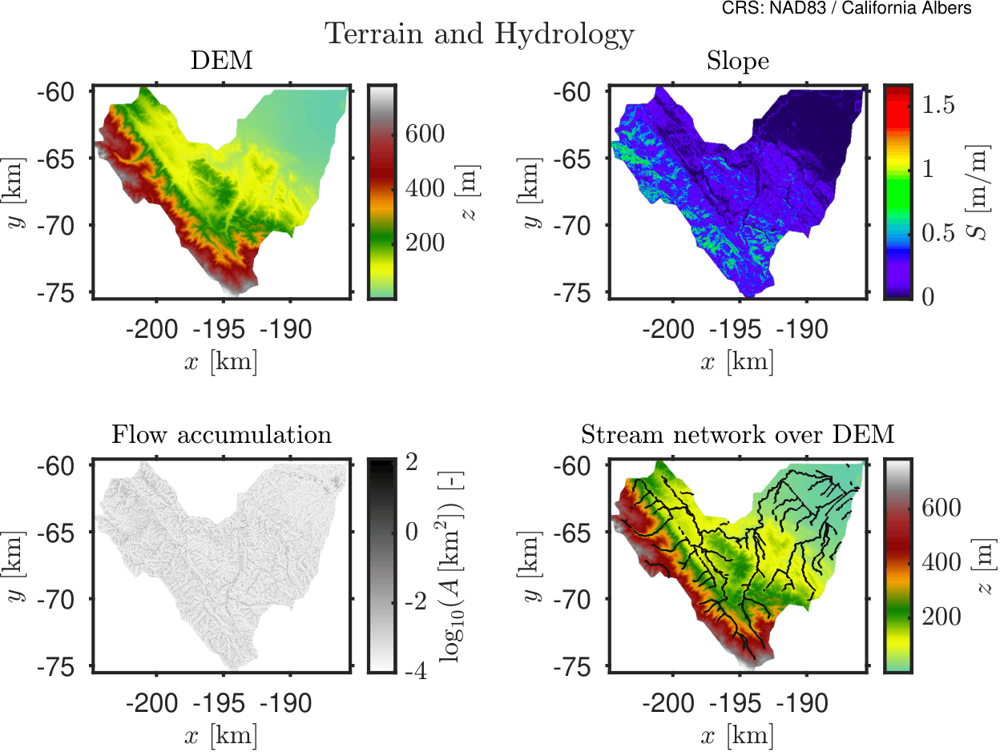

import useBaseUrl from '@docusaurus/useBaseUrl';

# Catchment Setup and Experiment Design Using 10 m LiDAR DEM

## Overview

This page presents the same hydrological experiment conducted over the San Francisquito Creek catchment, using identical inputs and configuration as the baseline case, with one key modification:

➡️ The terrain is now represented using a **LiDAR-derived Digital Elevation Model (DEM) at 10 m resolution**.

All other elements remain unchanged:
- Same catchment boundary  
- Same rainfall forcing  
- Same LULC and soil inputs  
- Same parameterization  
- Same simulation setup  

This allows a **direct, controlled comparison** to isolate the impact of terrain resolution on hydrological response.

---

## Input Data

The model uses the following datasets:

- **LiDAR DEM (10 m resolution)**  
- Land Use / Land Cover (LULC)  
- Soil Texture  
- Depth to bedrock / aquifer  

The LULC and soil datasets are identical to those used in the baseline experiment.

The only difference is the **higher-resolution elevation input**, which provides more detailed representation of:
- Micro-topography  
- Flow paths  
- Depressions  
- Urban features  

---

## Catchment Delineation

The catchment remains unchanged and corresponds to:

- **HydroBASINS Level 12 ID:** `7120013410`  
- **Watershed:** San Francisquito Creek  

The same polygon is used to ensure strict comparability between simulations.

---

## Spatial Processing

All datasets were processed as follows:

- Clipped to the catchment boundary  
- Reprojected to **EPSG:3310 (California Albers)**  
- Resampled to **10 m resolution**  
- Aligned to a common grid  

---

## Meteorological Forcing

The rainfall forcing is identical to the baseline experiment:

- **Intensity:** 100 mm/h  
- **Duration:** 1 hour  
- **Type:** Spatially uniform  

This simplified forcing ensures that differences in results are due only to terrain resolution.

---

## Study Objective

The goal of this experiment is to evaluate how a **high-resolution LiDAR DEM (10 m)** affects:

- Flow routing  
- Surface runoff connectivity  
- Ponding behavior  
- Spatial water-depth patterns  
- Timing of runoff propagation  

---

## Parameterization

### LULC

Same ESA WorldCover-based classification:

- Tree cover  
- Shrubland  
- Grassland  
- Cropland  
- Built-up (impervious)  
- Bare soil  
- Water  

Each class defines:
- Manning’s roughness  
- Storage  
- Runoff coefficients  

---

### Soil

Same USDA-based texture classification with parameters for:

- Hydraulic conductivity  
- Water retention  
- Soil moisture  
- Depth  
- Specific yield  

---

## Input Maps

### Figure 1 — LiDAR Terrain



*10 m LiDAR DEM showing detailed terrain structure and flow paths.*


## Model Configuration

### Time Parameters

| Parameter | Value |
|----------|------|
| Time step | 5 sec |
| Min step | 1 sec |
| Max step | 60 sec |
| Simulation time | 24 hours |
| Output interval | 15 min |

---

### Stability

| Parameter | Value |
|----------|------|
| Courant factor | 0.7 |

---

### Grid

| Parameter | Value |
|----------|------|
| Resolution | 10 m |
| Min contributing area | 0.5 km² |
| Smoothing factor | 0.2 |

---

### Results
The following figure shows the temporal dynamics of flood depths when using a LiDAR DEM with 10-m resolution.
<div style={{ textAlign: 'center' }}>
  <video width="90%" controls>
    <source src={useBaseUrl('/videos/stanford_lidar.mp4')} type="video/mp4" />
    Your browser does not support the video tag.
  </video>

  <p><em>HydroPol2D simulation of the observed San Francisquito rainfall event (10m resolution).</em></p>
</div>

If we compare to the 30-m resolution case, a very wide difference is observed.
<div style={{ textAlign: 'center' }}>
  <video width="90%" controls>
    <source src={useBaseUrl('/videos/stanford_big.mp4')} type="video/mp4" />
    Your browser does not support the video tag.
  </video>

  <p><em>HydroPol2D simulation of the observed San Francisquito rainfall event (30m resolution).</em></p>
</div>


From the results, we can clearly see the effect of having a higher resolution DEM. In addition, the downstream boundary condition is also significantly important in this analysis as the flow is constrained to narrower paths near the connection to the bay.

A python code to download LiDAR data within the US can be found below. Just change the inputs to represent your catchment.

```python
# download_USGS_DEM_direct_clipped.py

import os
import glob
import math
import shutil
import requests
import numpy as np
import rasterio
import geopandas as gpd

from shapely.geometry import shape
from shapely.ops import unary_union
from rasterio.features import shapes
from rasterio.merge import merge
from rasterio.mask import mask

# ============================================================
# USER INPUTS
# ============================================================

INPUT_PATH = r"/oak/stanford/groups/gorelick/HydroPol2D/Case_Studies/Stanford/Stanford_Big_Flood/Outputs/Modeling_Results/Rasters_Static/DEM_resampled.tif"

OUT_DEM = r"/oak/stanford/groups/gorelick/HydroPol2D/Case_Studies/Stanford/Stanford_Big_Flood/Static/USGS_DEM/USGS_10m_DEM_clipped.tif"

DOMAIN_SHP = r"/oak/stanford/groups/gorelick/HydroPol2D/Case_Studies/Stanford/Stanford_Big_Flood/Static/raster_domain_polygon.shp"

DOMAIN_MASK_TIF = r"/oak/stanford/groups/gorelick/HydroPol2D/Case_Studies/Stanford/Stanford_Big_Flood/Static/raster_domain_mask_debug.tif"

TARGET_RESOLUTION_METERS = 10.0

MIN_VALID_ELEVATION = -200.0
NODATA_VALUE = -9999.0

IMAGE_SERVICE_URL = "https://elevation.nationalmap.gov/arcgis/rest/services/3DEPElevation/ImageServer/exportImage"

MAX_TILE_PIXELS = 2000

FORCE_RECREATE_DOMAIN = True
FORCE_REDOWNLOAD_TILES = True

# ============================================================


def delete_shapefile(shp_path):
    base = os.path.splitext(shp_path)[0]
    for f in glob.glob(base + ".*"):
        try:
            os.remove(f)
        except Exception:
            pass


def delete_file_if_exists(path):
    if os.path.exists(path):
        os.remove(path)


def make_valid_mask(arr, raster_nodata):
    """
    Valid domain:
      DEM is finite
      DEM is not NaN
      DEM is not -9999
      DEM is not raster nodata
      DEM >= MIN_VALID_ELEVATION
    """

    valid = np.isfinite(arr)
    valid = valid & (~np.isnan(arr))
    valid = valid & (arr != -9999)
    valid = valid & (arr >= MIN_VALID_ELEVATION)

    if raster_nodata is not None:
        valid = valid & (arr != raster_nodata)

    return valid


def inspect_raster(raster_path):
    with rasterio.open(raster_path) as src:
        arr = src.read(1).astype("float64")

        print("")
        print("========== INPUT RASTER INSPECTION ==========")
        print("Raster:", raster_path)
        print("CRS:", src.crs)
        print("Width:", src.width)
        print("Height:", src.height)
        print("Bounds:", src.bounds)
        print("Transform:", src.transform)
        print("Raster nodata:", src.nodata)

        finite = np.isfinite(arr)

        print("Total cells:", arr.size)
        print("Finite cells:", np.count_nonzero(finite))
        print("NaN cells:", np.count_nonzero(np.isnan(arr)))
        print("-9999 cells:", np.count_nonzero(arr == -9999))
        print("Cells < {}:".format(MIN_VALID_ELEVATION), np.count_nonzero(arr < MIN_VALID_ELEVATION))

        if np.any(finite):
            print("Finite min:", np.nanmin(arr[finite]))
            print("Finite max:", np.nanmax(arr[finite]))
            print("Finite mean:", np.nanmean(arr[finite]))

        valid = make_valid_mask(arr, src.nodata)

        print("Valid cells:", np.count_nonzero(valid))
        print("Invalid cells:", valid.size - np.count_nonzero(valid))
        print("Valid percent:", 100.0 * np.count_nonzero(valid) / float(valid.size))
        print("=============================================")
        print("")


def write_debug_mask(mask_arr, reference_src, out_tif):
    profile = reference_src.profile.copy()
    profile.update({
        "driver": "GTiff",
        "dtype": "uint8",
        "count": 1,
        "nodata": 0,
        "compress": "lzw"
    })

    out_dir = os.path.dirname(out_tif)
    if out_dir:
        os.makedirs(out_dir, exist_ok=True)

    with rasterio.open(out_tif, "w", **profile) as dst:
        dst.write(mask_arr.astype("uint8"), 1)

    print("Wrote debug domain mask:")
    print(out_tif)


def shapefile_from_raster_valid_domain(raster_path, out_shp, out_mask_tif):
    """
    Creates polygon shapefile from valid raster cells only.
    """

    if FORCE_RECREATE_DOMAIN:
        delete_shapefile(out_shp)
        delete_file_if_exists(out_mask_tif)

    with rasterio.open(raster_path) as src:
        if src.crs is None:
            raise ValueError("Raster has no CRS.")

        arr = src.read(1).astype("float64")
        valid_mask = make_valid_mask(arr, src.nodata)

        n_valid = np.count_nonzero(valid_mask)
        n_total = valid_mask.size

        print("Creating domain polygon from valid cells...")
        print("Valid cells:", n_valid, "of", n_total)

        if n_valid == 0:
            raise ValueError(
                "No valid cells found. "
                "Try lowering MIN_VALID_ELEVATION or inspect DOMAIN_MASK_TIF."
            )

        write_debug_mask(valid_mask, src, out_mask_tif)

        results = shapes(
            valid_mask.astype("uint8"),
            mask=valid_mask,
            transform=src.transform
        )

        geoms = []

        for geom, value in results:
            if value == 1:
                geoms.append(shape(geom))

        crs = src.crs

    if not geoms:
        raise ValueError("No polygons created from valid mask.")

    print("Number of polygon pieces before union:", len(geoms))

    merged_geom = unary_union(geoms)

    gdf = gpd.GeoDataFrame(
        {"domain_id": [1]},
        geometry=[merged_geom],
        crs=crs
    )

    gdf["geometry"] = gdf.geometry.buffer(0)

    out_dir = os.path.dirname(out_shp)
    if out_dir:
        os.makedirs(out_dir, exist_ok=True)

    gdf.to_file(out_shp)

    print("Created domain shapefile:")
    print(out_shp)

    return out_shp


def get_boundary_gdf(input_path):
    ext = os.path.splitext(input_path)[1].lower()

    if ext == ".shp":
        print("Using provided shapefile as domain boundary...")
        gdf = gpd.read_file(input_path)
    else:
        print("Raster detected.")
        inspect_raster(input_path)
        shp = shapefile_from_raster_valid_domain(
            input_path,
            DOMAIN_SHP,
            DOMAIN_MASK_TIF
        )
        gdf = gpd.read_file(shp)

    if gdf.crs is None:
        raise ValueError("Input boundary has no CRS.")

    return gdf


def get_projected_boundary(gdf):
    if gdf.crs.is_projected:
        return gdf

    print("Input CRS is geographic. Reprojecting to EPSG:5070.")
    return gdf.to_crs("EPSG:5070")


def get_epsg(gdf):
    epsg = gdf.crs.to_epsg()

    if epsg is None:
        raise ValueError(
            "Could not determine EPSG code. "
            "Please reproject input raster/shapefile to a standard EPSG CRS."
        )

    return epsg


def make_tiles(bounds, resolution, max_tile_pixels):
    minx, miny, maxx, maxy = bounds

    tile_size = resolution * max_tile_pixels

    nx = int(math.ceil((maxx - minx) / tile_size))
    ny = int(math.ceil((maxy - miny) / tile_size))

    tiles = []

    for ix in range(nx):
        for iy in range(ny):
            x1 = minx + ix * tile_size
            x2 = min(minx + (ix + 1) * tile_size, maxx)

            y1 = miny + iy * tile_size
            y2 = min(miny + (iy + 1) * tile_size, maxy)

            tiles.append((x1, y1, x2, y2))

    return tiles


def download_dem_tile(tile_bounds, epsg, resolution, out_file):
    minx, miny, maxx, maxy = tile_bounds

    width = int(math.ceil((maxx - minx) / resolution))
    height = int(math.ceil((maxy - miny) / resolution))

    params = {
        "f": "image",
        "format": "tiff",
        "pixelType": "F32",
        "noData": str(NODATA_VALUE),
        "interpolation": "RSP_BilinearInterpolation",
        "bbox": "{},{},{},{}".format(minx, miny, maxx, maxy),
        "bboxSR": epsg,
        "imageSR": epsg,
        "size": "{},{}".format(width, height),
    }

    print("Downloading tile:", os.path.basename(out_file))

    r = requests.get(IMAGE_SERVICE_URL, params=params, timeout=300)
    r.raise_for_status()

    content_type = r.headers.get("Content-Type", "")

    if "image" not in content_type.lower() and "tiff" not in content_type.lower():
        print("Unexpected server response:")
        print(r.text[:1000])
        raise RuntimeError("USGS did not return a TIFF image.")

    with open(out_file, "wb") as f:
        f.write(r.content)


def mosaic_tiles(tile_files, out_dem):
    srcs = [rasterio.open(f) for f in tile_files]

    mosaic, transform = merge(srcs, nodata=NODATA_VALUE)

    meta = srcs[0].meta.copy()
    meta.update({
        "driver": "GTiff",
        "height": mosaic.shape[1],
        "width": mosaic.shape[2],
        "transform": transform,
        "compress": "lzw",
        "nodata": NODATA_VALUE,
        "dtype": "float32",
    })

    os.makedirs(os.path.dirname(out_dem), exist_ok=True)

    with rasterio.open(out_dem, "w", **meta) as dst:
        dst.write(mosaic.astype("float32"))

    for src in srcs:
        src.close()


def clip_raster_to_boundary(input_raster, boundary_gdf, output_raster):
    with rasterio.open(input_raster) as src:
        boundary = boundary_gdf.to_crs(src.crs)

        shapes_list = [
            geom for geom in boundary.geometry
            if geom is not None and not geom.is_empty
        ]

        if not shapes_list:
            raise ValueError("No valid geometries found for clipping.")

        clipped, clipped_transform = mask(
            src,
            shapes_list,
            crop=True,
            nodata=NODATA_VALUE,
            filled=True
        )

        meta = src.meta.copy()
        meta.update({
            "driver": "GTiff",
            "height": clipped.shape[1],
            "width": clipped.shape[2],
            "transform": clipped_transform,
            "nodata": NODATA_VALUE,
            "compress": "lzw",
            "dtype": "float32",
        })

        os.makedirs(os.path.dirname(output_raster), exist_ok=True)

        with rasterio.open(output_raster, "w", **meta) as dst:
            dst.write(clipped.astype("float32"))


def main():
    out_dir = os.path.dirname(OUT_DEM)
    os.makedirs(out_dir, exist_ok=True)

    tmp_dir = os.path.join(out_dir, "_tiles")

    if FORCE_REDOWNLOAD_TILES and os.path.exists(tmp_dir):
        print("Deleting old tile directory:")
        print(tmp_dir)
        shutil.rmtree(tmp_dir)

    os.makedirs(tmp_dir, exist_ok=True)

    raw_bbox_dem = OUT_DEM.replace(".tif", "_bbox.tif")

    if FORCE_REDOWNLOAD_TILES:
        delete_file_if_exists(raw_bbox_dem)
        delete_file_if_exists(OUT_DEM)

    gdf = get_boundary_gdf(INPUT_PATH)
    gdf_proj = get_projected_boundary(gdf)

    epsg = get_epsg(gdf_proj)
    bounds = gdf_proj.total_bounds

    print("Domain shapefile:", DOMAIN_SHP)
    print("Debug domain mask:", DOMAIN_MASK_TIF)
    print("Raw bounding-box DEM:", raw_bbox_dem)
    print("Final clipped DEM:", OUT_DEM)
    print("Download CRS: EPSG:{}".format(epsg))
    print("Bounds:", bounds)
    print("Resolution:", TARGET_RESOLUTION_METERS, "meters")

    tiles = make_tiles(bounds, TARGET_RESOLUTION_METERS, MAX_TILE_PIXELS)
    print("Number of tiles:", len(tiles))

    tile_files = []

    for i, tile in enumerate(tiles):
        tile_file = os.path.join(tmp_dir, "tile_{:04d}.tif".format(i + 1))

        download_dem_tile(
            tile_bounds=tile,
            epsg=epsg,
            resolution=TARGET_RESOLUTION_METERS,
            out_file=tile_file,
        )

        tile_files.append(tile_file)

    print("Mosaicking tiles into bounding-box DEM...")
    mosaic_tiles(tile_files, raw_bbox_dem)

    print("Clipping DEM to valid raster-domain polygon...")
    clip_raster_to_boundary(raw_bbox_dem, gdf, OUT_DEM)

    print("Done.")
    print("Created clipped DEM:")
    print(OUT_DEM)
    print("Created domain shapefile:")
    print(DOMAIN_SHP)
    print("Created debug mask:")
    print(DOMAIN_MASK_TIF)


if __name__ == "__main__":
    main()